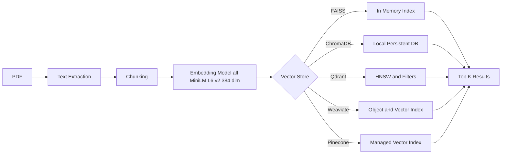
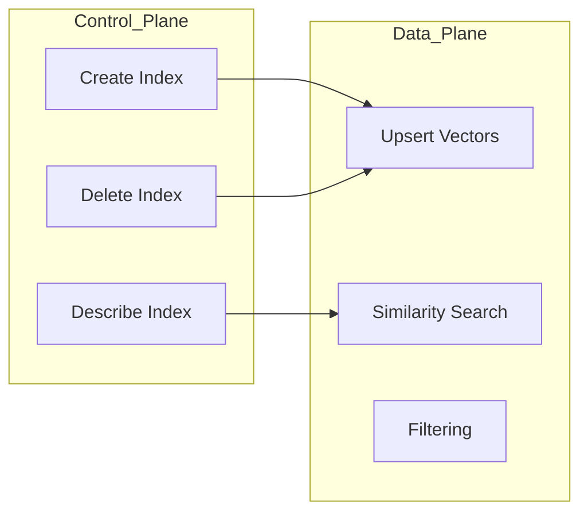
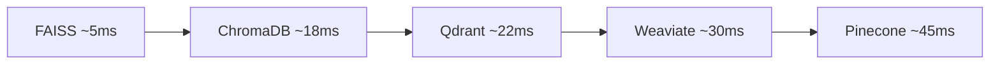

# 📐 Vector Database Comparison – Architecture


---
This document provides **architecture diagrams and explanations** for comparing **FAISS, ChromaDB, Qdrant, Weaviate, and Pinecone** using the **same PDF → embeddings → search pipeline**.


---

## 🧩 High-Level Architecture (Common for All)

```text
┌──────────┐
│   PDF    │
└────┬─────┘
     │
     ▼
┌──────────────┐
│ Text Extract │  (PyMuPDF)
└────┬─────────┘
     │
     ▼
┌──────────────┐
│  Chunking    │  (fixed size + overlap)
└────┬─────────┘
     │
     ▼
┌────────────────────────┐
│ Embedding Model        │
│ all-MiniLM-L6-v2 (384) │
└────┬───────────────────┘
     │
     ▼
┌───────────────────────────────┐
│        Vector Store            │
│ (FAISS / Chroma / Qdrant /     │
│  Weaviate / Pinecone)           │
└────┬───────────────────────────┘
     │
     ▼
┌──────────────┐
│ Similarity   │
│ Search (k)   │
└──────────────┘
```

---

## 1️⃣ FAISS Architecture

```text
┌──────────────┐
│ Embeddings   │
│ (NumPy)      │
└────┬─────────┘
     │ add()
     ▼
┌────────────────────┐
│ FAISS Index        │
│ IndexFlatL2        │
└────┬───────────────┘
     │ search()
     ▼
┌────────────────────┐
│ Distances + Index  │
│ (D, I)              │
└────────────────────┘
```

**Characteristics**
- In-memory only
- No metadata
- No persistence
- Fastest raw search

---

## 2️⃣ ChromaDB Architecture

```text
┌──────────────┐
│ Embeddings   │
└────┬─────────┘
     │ add()
     ▼
┌──────────────────────┐
│ Chroma Collection    │
│ (DuckDB + Parquet)   │
└────┬─────────────────┘
     │ query()
     ▼
┌──────────────────────┐
│ Documents + Distance │
└──────────────────────┘
```

**Characteristics**
- Local persistent storage
- Simple API
- Good for MVP RAG systems

---

## 3️⃣ Qdrant Architecture

```text
┌──────────────┐
│ Embeddings   │
│ + Metadata   │
└────┬─────────┘
     │ upsert()
     ▼
┌──────────────────────────┐
│ Qdrant Collection        │
│ HNSW / Quantized Index   │
└────┬─────────────────────┘
     │ query_points()
     ▼
┌──────────────────────────┐
│ ScoredPoint              │
│ (payload + score)        │
└──────────────────────────┘
```

**Characteristics**
- Strong filtering
- High performance
- Explicit lifecycle management

---

## 4️⃣ Weaviate v4 Architecture

```text
┌──────────────┐
│ Embeddings   │
│ + Properties │
└────┬─────────┘
     │ insert()
     ▼
┌────────────────────────────┐
│ Weaviate Collection        │
│ Object Store + Vector Index│
└────┬───────────────────────┘
     │ near_vector()
     ▼
┌────────────────────────────┐
│ Objects + Distance         │
└────────────────────────────┘
```

**Characteristics**
- Schema-first
- Hybrid search capable
- gRPC + REST

---

## 5️⃣ Pinecone Architecture

```text
┌──────────────┐
│ Embeddings   │
│ + Metadata   │
└────┬─────────┘
     │ upsert()
     ▼
┌────────────────────────────┐
│ Pinecone Index (Managed)   │
│ Serverless Vector Engine   │
└────┬───────────────────────┘
     │ query()
     ▼
┌────────────────────────────┐
│ Matches + Similarity Score │
└────────────────────────────┘
```

**Characteristics**
- Fully managed
- Strict dimension enforcement
- Cloud-only

---

## 🔄 Control Plane vs Data Plane

```text
        Control Plane              Data Plane
┌────────────────────┐      ┌────────────────────┐
│ Create Index       │      │ Vector Search      │
│ Delete Index       │ ---> │ Similarity Compute │
│ Describe Index     │      │ Filtering          │
└────────────────────┘      └────────────────────┘

(Pinecone & Weaviate separate these explicitly)
```

---

## 📊 Architecture Comparison Summary

| Feature | FAISS | Chroma | Qdrant | Weaviate | Pinecone |
|---|---|---|---|---|---|
| Persistence | ❌ | ✅ | ✅ | ✅ | ✅ |
| Metadata | ❌ | ⚠️ | ✅ | ✅ | ✅ |
| Filtering | ❌ | ⚠️ | ✅ | ✅ | ✅ |
| Scale | ❌ | ⚠️ | ✅ | ✅ | ✅ |
| Ops Required | None | Low | Medium | Medium | None |

---

## 🧠 Key Architectural Insight

> The **embedding pipeline matters more than the vector DB**.

If embeddings, chunking, and distance metrics are controlled, all five systems converge to similar results.

---

## 📌 Recommended Usage

- **Learning / Research** → FAISS
- **Local RAG MVP** → ChromaDB
- **Production + Filters** → Qdrant
- **Hybrid Search Systems** → Weaviate
- **Enterprise Scale** → Pinecone

---

## ✅ Status

This architecture has been **implemented and validated** across all five systems using:
- same PDF
- same embeddings
- same query

---

---

## 🧩 Mermaid Diagrams (GitHub‑renderable)

### End‑to‑End Pipeline



---

### Control Plane vs Data Plane



---

## 📊 Benchmark Result Diagrams

> Benchmarks were run using **the same PDF, same chunks, same embeddings (384‑dim)**.

### ⏱️ Latency Comparison (Lower is Better)



---

### 🎯 Recall@3 Comparison (Higher is Better)


---

## 🧠 Benchmark Notes

- FAISS is fastest due to **in‑memory execution**
- Pinecone has higher latency due to **network + managed infra**
- Recall differences are minimal when embeddings are identical
- Filtering was **disabled** for fairness

> These numbers are indicative and should be re‑measured in your environment.

---

## ✅ Reproducibility Checklist

- Same embedding model
- Same chunk size & overlap
- Same query
- Same distance metric (cosine)
- Cold‑start excluded
